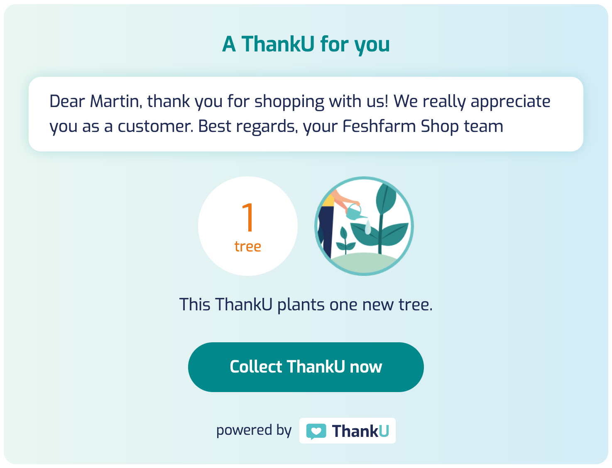

**Say ThankU and Do Good** • [www.thanku.social](https://www.thanku.social) • Plant trees, clean the ocean, and protect animals

---

# ThankU Postpaid Widget (Web Component)

Create ThankUs on the fly and show your customers that you care about the environment.



**See a DEMO here: https://thanku.github.io/postpaid-widget/**

We make use of the latest browser features ([Web Components](https://developer.mozilla.org/en-US/docs/Web/Web_Components), [module scripts](https://developer.mozilla.org/en-US/docs/Web/JavaScript/Guide/Modules), [fetch](https://developer.mozilla.org/en-US/docs/Web/API/Fetch_API), [CSS variables](https://developer.mozilla.org/en-US/docs/Web/CSS/--*), etc.) which are well supported in current versions of [Google Chrome](https://www.google.com/chrome/), [Mozilla Firefox](https://www.mozilla.org/en-US/firefox/new/), [Apple Safari](https://www.apple.com/safari/) and [Microsoft Edge](https://www.microsoft.com/en-us/edge). If you need to target older browser versions or Microsoft Internet Explorer, you need to provide appropriate polyfills.

Under the hood we use the awesome [hybrids](https://hybrids.js.org), a UI library for creating Web Components, via CDN import.

## Installation

### Self hosted

Add the following to an HTML document:

```html
<script type="module" src="path/to/postpaid-widget.js"></script>
```

### CDN

Add the following to an HTML document:

```html
<script type="module" src="https://unpkg.com/@thanku/postpaid-widget"></script>
```

### [NPM](https://www.npmjs.com/package/@thanku/postpaid-widget)

Run `npm i @thanku/postpaid-widget`.

## Usage

This widget is intended for **ThankU for Business** partners. Before using this widget you need to [create your own ThankU page](https://www.thanku.social/en/app/profile/preview). And we need to setup the required configuration for you. So if you are interested in using the ThankU Postpaid Widget, do not hesitate to get in touch with us via: business@thanku.social.

---

Create a `<thanku-postpaid-widget>` element with default content for users of browsers that don't support Web Components and add the required attributes mentioned below.

```html
<thanku-postpaid-widget
  slug="freshfarm-shop"
  cause="PlantTrees"
  impact="1"
  message="Dear Mrs. Johnson, thank you for shopping with us! We really appreciate you as a customer. Best regards, your Feshfarm Shop team"
  pid="SOME_UNIQUE_ID"
  sig="THE_SIGNATURE_CREATED_WITH_YOUR_SECRET"
  lang="en"
>
  <!-- [start] fallback content if web components are not supported -->
  <p>
    Dear Mrs. Johnson, thank you for shopping with us! We really appreciate you
    as a customer. Best regards, your Feshfarm Shop team
  </p>
  <!-- [end] -->
</thanku-postpaid-widget>
```

To get the full ThankU look and feel, also include the following font inside `<head>`:

```html
<link href="https://www.thanku.social/fonts/exo.css" rel="stylesheet" />
```

### Attributes

| name       | required | default | description                                                                                                                                              |
| ---------- | -------- | ------- | -------------------------------------------------------------------------------------------------------------------------------------------------------- |
| `slug`     | ✔️       | -       | Your ThankU page name                                                                                                                                    |
| `cause`    | ✔️       | -       | The good cause you want to support (possible values: `PlantTrees`, `CleanOcean`, `ProtectWildlife`)                                                      |
| `impact`   | ✔️       | -       | The impact value (a positive integer). Depending on the selected `cause` this value represents either number of trees, kg plastic or sqm habitat.        |
| `message`  | ✔️       | -       | The ThankU message you want to show                                                                                                                      |
| `pid`      | ✔️       | -       | The postpaid id (an unique id like e.g. your order id)                                                                                                   |
| `sig`      | ✔️       | -       | The signature, a HMAC-SHA256 hash (hex encoded) generated with your secret `token` (`sig` needs to be generated server-side to keep your `token` secret) |
| `lang`     |          | `en`    | The language used for the widget and for the generated ThankU (possible values: `en`, `de`)                                                              |
| `simulate` |          | -       | If defined no data will be stored on our side, so no ThankU will be created. Great for testing!                                                          |

Basically it's possible to update attributes programatically, but you should be aware of the fact that the signature `sig` depends on the other attributes and that a new ThankU will be generated then. So better avoid updating attributes after the component was rendered.

### Styling

The style of the `<thanku-postpaid-widget>` element can be changed by setting the following custom properties / CSS variables:

- `--bg-image` - The background image of the widget (e.g. an image or gradient or `none`)
- `--bg-color` - The background color of the widget
- `--bg-color-button` - The background color of the button
- `--bg-color-button-hover` - The background hover color of the button
- `--bg-color-impact` - The background color of the impact bubble
- `--bg-color-message` - The background color of the message box
- `--color-text-base` - The base color of the text
- `--color-text-headline` - The color of the headline text
- `--color-text-impact` - The color of the impact bubble text
- `--color-text-button` - The color of the button text
- `--color-text-message` - The color of the message text
- `--shadow-color-message` - The shadow color of the message box
- `--font-family` - The font family of the text (defaults to `"Exo", sans-serif`)
- `--font-size-base` - The base font size (small screens, mobile)
- `--font-size-sm` - The base font size for screens >= 640px (responsive)
- `--font-size-md` - The base font size for screens >= 768px (responsive)
- `--font-size-lg` - The base font size for screens >= 1024px (responsive)

The CSS variables can be set e.g. inline via the `style` attribute like this:

```html
<thanku-postpaid-widget
  slug="freshfarm-shop"
  ...
  style="--bg-color: #202c55;
         --bg-image: none;
         --color-text-base: white;
         --color-text-headline: #78c0c4;
         --font-family: 'Roboto Mono', monospace"
>
</thanku-postpaid-widget>
```

## License

[MIT License](LICENSE)
